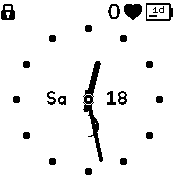

# banglejs-2-twelve-numbered-clock-face #

a simple clock face with 12 dots for analog clocks on a Bangle.js 2

This module draws a face with the 12 dots for an analog clock running on a [Bangle.js 2](https://www.espruino.com/Bangle.js2).

<table>
 <tr valign="top">
   <td align="center"><br>only dots</td>
 </tr>
</table>

## Usage ##

Within a clock implementation, the module may be used as follows:

```javascript
let Clockwork = require(...);
Clockwork.windUp({
  face:require('https://raw.githubusercontent.com/rozek/banglejs-2-twelve-numbered-clock-face/main/ClockFace.js'),
  ...
}, { withDots:true });
```


## Example ##

The following code shows a complete example for a (still simple) analog clock using this clock face:

```javascript
let Clockwork = require('https://raw.githubusercontent.com/rozek/banglejs-2-simple-clockwork/main/Clockwork.js');

Clockwork.windUp({
  face: require('https://raw.githubusercontent.com/DanielDecker/banglejs-2-only-dots-clock-face/main/ClockFace.js'),
  hands:require('https://raw.githubusercontent.com/rozek/banglejs-2-simple-clock-hands/main/ClockHands.js'),
},{
  Foreground:'#000000', Background:'#FFFFFF', Seconds:'#FF0000'
});
```

## License ##

[MIT License](LICENSE.md)
